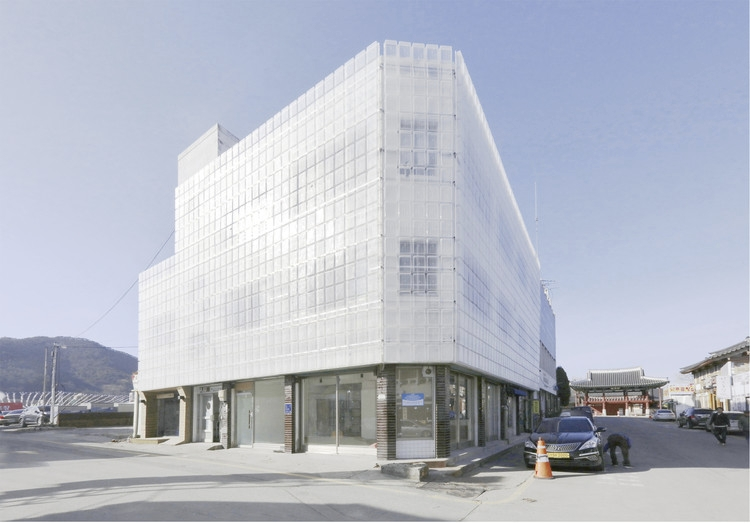
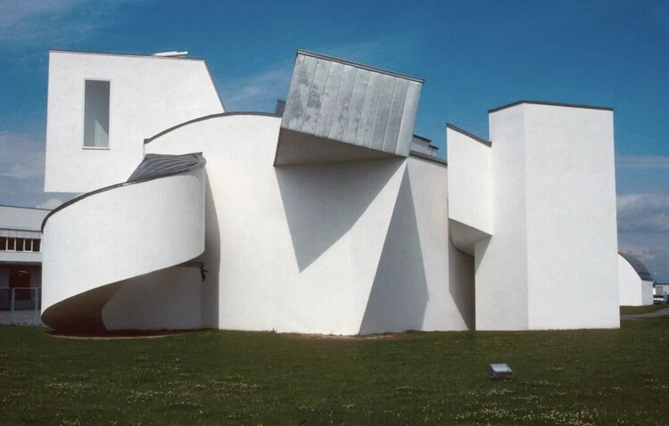
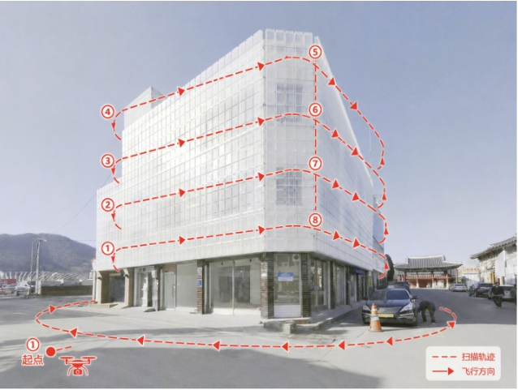
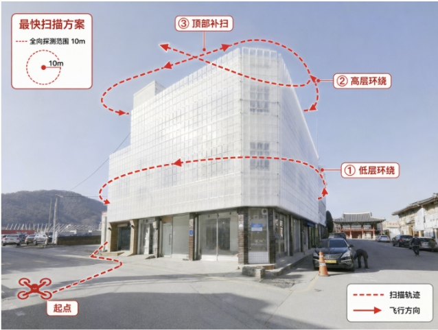
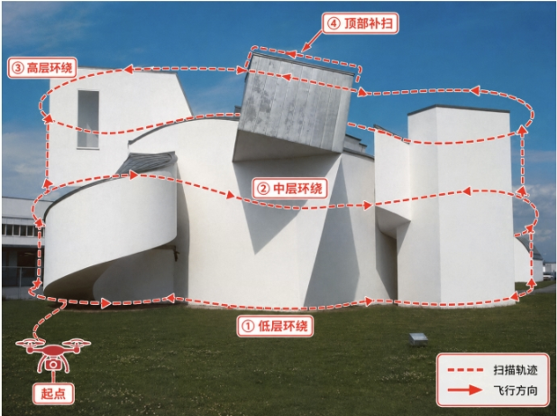
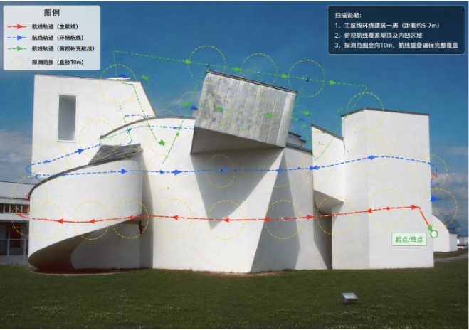

# 开放权重图像编辑模型在无人机扫描航线可视化任务中的技术评估报告

版本：v0.1  
日期：2026-06-29  
状态：阶段性 Markdown 母版

## 目录

1. [摘要](#1-摘要)
2. [项目背景](#2-项目背景)
3. [业务目标](#3-业务目标)
4. [输入输出定义](#4-输入输出定义)
5. [当前实验条件与限制](#5-当前实验条件与限制)
6. [测试图片说明](#6-测试图片说明)
7. [四个测试用例](#7-四个测试用例)
8. [参考结果说明](#8-参考结果说明)
9. [候选模型概览](#9-候选模型概览)
10. [BAGEL 模型说明](#10-bagel-模型说明)
11. [Qwen-Image-Edit 模型说明](#11-qwen-image-edit-模型说明)
12. [其他候选模型调研](#12-其他候选模型调研)
13. [测试方式](#13-测试方式)
14. [Prompt 设计](#14-prompt-设计)
15. [BAGEL 本地测试结果](#15-bagel-本地测试结果)
16. [Qwen-Image-Edit ModelScope 在线测试结果](#16-qwen-image-edit-modelscope-在线测试结果)
17. [规则建筑结果对比](#17-规则建筑结果对比)
18. [异形建筑结果对比](#18-异形建筑结果对比)
19. [基础任务与优化任务对比](#19-基础任务与优化任务对比)
20. [推理速度与部署条件](#20-推理速度与部署条件)
21. [当前定性观察](#21-当前定性观察)
22. [生成式图像编辑方案的优势](#22-生成式图像编辑方案的优势)
23. [生成式图像编辑方案的局限](#23-生成式图像编辑方案的局限)
24. [替代或混合技术路线](#24-替代或混合技术路线)
25. [当前结论](#25-当前结论)
26. [后续工作](#26-后续工作)
27. [参考资料](#27-参考资料)

## 1. 摘要

本报告评估开放权重图像编辑模型在“给建筑图片叠加无人机扫描航线示意图”任务中的可行性。当前阶段不是严格学术 benchmark，不输出综合分或模型排名，重点是建立可持续维护的 Markdown 报告结构，展示输入图片、Prompt、参考效果、模型输出位置、测试方式和已知限制。

当前已知：BAGEL NF4 可在本地 NVIDIA RTX 4070 Ti Super 16GB 上完成图像编辑，单次约 75 秒；Qwen-Image-Edit 当前通过 ModelScope 魔搭社区在线体验测试。当前仓库未提供 BAGEL 或 Qwen-Image-Edit 的实际输出图片文件，因此本版报告只展示原始图片与参考效果，并为模型输出保留明确位置。

## 2. 项目背景

无人机建筑扫描任务需要把扫描目标、覆盖方式和飞行方向清晰表达出来。生成式图像编辑模型可以直接根据图片和自然语言 Prompt 输出带航线标注的图片，适合作为低成本原型验证方式。

但该类输出本质是像素图，不能直接作为飞控航点。真实飞行仍需要尺度、相机参数、点云、Mesh、BIM、多视角信息、障碍物和无人机运动约束。

## 3. 业务目标

本阶段目标是评估模型是否能：

- 识别规则建筑和异形建筑。
- 按 Prompt 在原图上绘制扫描航线。
- 表达主扫描路线、辅助路线、补扫路线、方向箭头、起点和终点。
- 在优化任务中表达 10 m 探测范围概念。
- 尽量保持原始图片中非航线区域不变。
- 为后续“视觉理解 + 结构化路线 + 确定性绘制”路线提供判断依据。

## 4. 输入输出定义

输入：

- 建筑或其他无人机待扫描目标的原始图片。
- 描述扫描目标、扫描方式和覆盖要求的自然语言 Prompt。

输出：

- 带无人机扫描航线标注的图片。
- 航线可以包含主扫描路径、辅助路径、补扫路径、方向箭头、起点、终点和覆盖范围。

输出边界：当前输出是视觉示意图，不是真实可执行无人机航线。

## 5. 当前实验条件与限制

- 当前无法使用公司服务器或高显存云端服务器。
- 当前本地硬件能够部署的模型只有 BAGEL NF4 量化版本。
- BAGEL 当前运行硬件为 NVIDIA RTX 4070 Ti Super 16GB。
- BAGEL NF4 当前单次图像编辑约为 75 秒。
- 其他大型模型目前不要求本地部署。
- Qwen-Image-Edit 当前通过 ModelScope 魔搭社区在线体验页面测试。
- ModelScope 在线体验的 GPU、精度、推理框架和服务端优化通常未知。
- 当前没有成熟、统一的人工评分标准。

## 6. 测试图片说明

### 规则建筑原始图片



用途：TC-01 和 TC-02 的原始输入图片，不带航线标注。

### 异形建筑原始图片



用途：TC-03 和 TC-04 的原始输入图片，不带航线标注。

## 7. 四个测试用例

完整定义见 [TEST_CASES.md](TEST_CASES.md)。

- TC-01：规则建筑基础扫描航线生成。
- TC-02：规则建筑带 10 m 探测范围的优化航线生成。
- TC-03：异形建筑基础扫描航线生成。
- TC-04：异形建筑带 10 m 探测范围的优化航线生成。

## 8. 参考结果说明

以下图片是参考方案、qualitative reference、预期输出形式或目标效果示例。它们不是唯一正确答案，不是 Ground Truth，不是真实最短路径，也不是可直接执行航线。

| 用例 | 参考效果 |
| --- | --- |
| TC-01 |  |
| TC-02 |  |
| TC-03 |  |
| TC-04 |  |

## 9. 候选模型概览

| 模型 | 发布机构 | 指令式图像编辑 | 权重开放 | 许可证 | 当前测试方式 | 测试状态 |
| --- | --- | --- | --- | --- | --- | --- |
| BAGEL | ByteDance-Seed | 是 | 是 | Apache-2.0 | 本地 NF4 | 已本地测试 |
| Qwen-Image-Edit | Qwen / Alibaba | 是 | 是 | Apache-2.0 | ModelScope 在线体验 | 已在线测试 |
| FLUX.1 Kontext [dev] | Black Forest Labs | 是 | 是 | FLUX.1 [dev] Non-Commercial License | 资料调研 | 仅完成资料调研 |
| Step1X-Edit | StepFun AI | 是 | 是 | Apache-2.0 | 资料调研 | 仅完成资料调研 |
| OmniGen2 | VectorSpaceLab / BAAI 相关项目 | 是，待接口复核 | 是 | Apache-2.0 | 资料调研 | 仅完成资料调研 |
| FireRed-Image-Edit | FireRedTeam | 是 | 是 | Apache-2.0 | 资料调研 | 仅完成资料调研 |
| HunyuanImage | Tencent Hunyuan | Instruct / Image-to-Image 待测试 | 是 | 待确认 | 资料调研 | 仅完成资料调研 |

不要将“开放权重”等同于“允许商业使用”。商业使用状态需要按官方许可证和公司合规要求复核。

## 10. BAGEL 模型说明

详细记录见 [model_notes/BAGEL.md](model_notes/BAGEL.md)。

BAGEL 是 ByteDance-Seed 发布的统一多模态理解与生成模型，支持图像编辑。本项目当前使用本地 NF4 量化版本，在 NVIDIA RTX 4070 Ti Super 16GB 上单次图像编辑约 75 秒。仍待确认推理步数、Guidance、分辨率、CPU offload、峰值显存和重复运行平均耗时。

## 11. Qwen-Image-Edit 模型说明

详细记录见 [model_notes/QWEN_IMAGE_EDIT.md](model_notes/QWEN_IMAGE_EDIT.md)。

Qwen-Image-Edit 当前测试方式必须写为 ModelScope 魔搭社区在线体验。当前不能写成 Hugging Face Inference Providers 或 fal。在线体验的服务端硬件、精度、量化方式、推理框架、排队情况和纯模型推理时间均待确认。

## 12. 其他候选模型调研

详细记录：

- [FLUX_KONTEXT.md](model_notes/FLUX_KONTEXT.md)
- [STEP1X_EDIT.md](model_notes/STEP1X_EDIT.md)
- [OMNIGEN2.md](model_notes/OMNIGEN2.md)
- [FIRERED_IMAGE_EDIT.md](model_notes/FIRERED_IMAGE_EDIT.md)
- [HUNYUAN_IMAGE_EDIT.md](model_notes/HUNYUAN_IMAGE_EDIT.md)

这些模型当前未在本项目素材上完成测试，不生成效果结论。

## 13. 测试方式

当前测试记录模板见 [TEST_PROTOCOL.md](TEST_PROTOCOL.md)。每个结果需要记录测试用例、平台、模型版本、运行方式、推理耗时、输入图片、Prompt、输出图片和定性观察。

## 14. Prompt 设计

四个 Prompt 文件：

- [TC01_regular_building_basic.md](prompts/TC01_regular_building_basic.md)
- [TC02_regular_building_optimized.md](prompts/TC02_regular_building_optimized.md)
- [TC03_irregular_building_basic.md](prompts/TC03_irregular_building_basic.md)
- [TC04_irregular_building_optimized.md](prompts/TC04_irregular_building_optimized.md)

Prompt 明确要求区分地面环绕路线、水平扫描路线、垂直连接路线、主扫描路线、辅助路线、顶部补扫、起点、终点、方向箭头和探测覆盖范围，并禁止重绘天空、改变建筑材料、改变门窗、改变车辆人物、改变背景建筑、随机生成多余路线或删除原图内容。

## 15. BAGEL 本地测试结果

当前记录：已本地测试，BAGEL NF4，NVIDIA RTX 4070 Ti Super 16GB，单次约 75 秒。当前仓库未提供 BAGEL 输出图片文件，因此以下章节保留输出位置。

### TC-01

原始图片：


测试 Prompt：[TC01_regular_building_basic.md](prompts/TC01_regular_building_basic.md)

参考效果：


BAGEL 输出：当前未在仓库中找到，等待补充到 `../../inputs/current_outputs/bagel/`。

结果观察：当前无法对图片效果做结论。

### TC-02

原始图片：


测试 Prompt：[TC02_regular_building_optimized.md](prompts/TC02_regular_building_optimized.md)

参考效果：


BAGEL 输出：当前未在仓库中找到，等待补充到 `../../inputs/current_outputs/bagel/`。

结果观察：当前无法对图片效果做结论。

### TC-03

原始图片：


测试 Prompt：[TC03_irregular_building_basic.md](prompts/TC03_irregular_building_basic.md)

参考效果：


BAGEL 输出：当前未在仓库中找到，等待补充到 `../../inputs/current_outputs/bagel/`。

结果观察：当前无法对图片效果做结论。

### TC-04

原始图片：


测试 Prompt：[TC04_irregular_building_optimized.md](prompts/TC04_irregular_building_optimized.md)

参考效果：


BAGEL 输出：当前未在仓库中找到，等待补充到 `../../inputs/current_outputs/bagel/`。

结果观察：当前无法对图片效果做结论。

## 16. Qwen-Image-Edit ModelScope 在线测试结果

当前记录：已通过 ModelScope 魔搭社区在线体验测试。服务端 GPU、精度、量化方式、推理框架、排队情况和纯模型推理时间未知。当前仓库未提供输出图片或页面截图。

### TC-01

原始图片：


测试 Prompt：[TC01_regular_building_basic.md](prompts/TC01_regular_building_basic.md)

参考效果：


Qwen-Image-Edit 输出：当前未在仓库中找到，等待补充到 `../../inputs/current_outputs/qwen-image-edit/`。

### TC-02

原始图片：


测试 Prompt：[TC02_regular_building_optimized.md](prompts/TC02_regular_building_optimized.md)

参考效果：


Qwen-Image-Edit 输出：当前未在仓库中找到，等待补充到 `../../inputs/current_outputs/qwen-image-edit/`。

### TC-03

原始图片：


测试 Prompt：[TC03_irregular_building_basic.md](prompts/TC03_irregular_building_basic.md)

参考效果：


Qwen-Image-Edit 输出：当前未在仓库中找到，等待补充到 `../../inputs/current_outputs/qwen-image-edit/`。

### TC-04

原始图片：


测试 Prompt：[TC04_irregular_building_optimized.md](prompts/TC04_irregular_building_optimized.md)

参考效果：


Qwen-Image-Edit 输出：当前未在仓库中找到，等待补充到 `../../inputs/current_outputs/qwen-image-edit/`。

## 17. 规则建筑结果对比

当前可展示内容包括 TC-01、TC-02 原始图和参考效果。BAGEL 与 Qwen-Image-Edit 输出图当前缺失，无法比较两者对规则建筑的实际效果。

后续补充输出后，重点观察：

- 是否识别正确建筑。
- 是否理解正面、侧面和转角。
- 航线是否沿建筑外形分布。
- 路线是否连续。
- 是否出现明显随机曲线。
- 是否错误修改原图。

## 18. 异形建筑结果对比

当前可展示内容包括 TC-03、TC-04 原始图和参考效果。BAGEL 与 Qwen-Image-Edit 输出图当前缺失，无法比较两者对异形建筑的实际效果。

后续补充输出后，重点观察：

- 模型是否理解复杂建筑轮廓。
- 航线是否随异形结构变化。
- 是否存在穿过建筑内部的明显错误。
- 多个体块之间的路线是否连贯。
- 是否保留原图。

## 19. 基础任务与优化任务对比

基础任务关注模型是否能生成完整航线。优化任务额外关注 10 m 探测范围、减少重复扫描层、顶部补扫、辅助路线和覆盖范围表达。

限制：单张普通图片无法恢复建筑真实尺度、完整深度和准确物理距离。10 m 覆盖范围只评价视觉上合理的覆盖优化示意，不验证真实距离，也不证明全局最短路径。

## 20. 推理速度与部署条件

| 模型 | 当前方式 | 硬件 | 量化/精度 | 耗时 | 说明 |
| --- | --- | --- | --- | --- | --- |
| BAGEL | 本地 | NVIDIA RTX 4070 Ti Super 16GB | NF4 | 约 75 秒/次 | 是否包含加载、预热和具体参数待确认 |
| Qwen-Image-Edit | ModelScope 在线体验 | 未公开 | 未知 | 待确认 | 不可与本地 BAGEL 直接公平对比 |
| FLUX.1 Kontext [dev] | 未测试 | 待服务器资源 | 待确认 | 待测试 | 仅资料调研 |
| Step1X-Edit | 未测试 | 待服务器资源 | 待确认 | 待测试 | 仅资料调研 |
| OmniGen2 | 未测试 | 待服务器资源 | 待确认 | 待测试 | 仅资料调研 |
| FireRed-Image-Edit | 未测试 | 待服务器资源 | 待确认 | 待测试 | 仅资料调研 |
| HunyuanImage | 未测试 | 待服务器资源 | 待确认 | 待测试 | 仅资料调研 |

## 21. 当前定性观察

当前阶段可以确认测试条件，但不能对缺失输出图片的实际效果做图像结论。

可确认观察：

- BAGEL NF4 已能够在本地完成特定图像编辑任务。
- BAGEL 当前 75 秒/次延迟偏高。
- Qwen-Image-Edit 可以通过 ModelScope 魔搭社区在线体验测试。
- 当前更适合以图片可视化对比为核心，而不是做严格 benchmark。

## 22. 生成式图像编辑方案的优势

- 原型实现快。
- 能够直接理解自然语言 Prompt。
- 对不同建筑外形可能具有一定泛化能力。
- 输出直观，便于非技术人员理解。
- 适合快速探索“用户想看到什么样的航线表达”。

## 23. 生成式图像编辑方案的局限

- 可能修改原图非航线区域。
- 路线结构不稳定。
- 推理延迟较高。
- 输出只有像素，缺少可验证路线数据。
- 难以直接进入飞控系统。
- 单张图片无法提供真实尺度、深度、遮挡和障碍物信息。

## 24. 替代或混合技术路线

### 路线 A：生成式图像编辑

```text
图片 + 文本 Prompt
        ↓
图像编辑模型
        ↓
带航线标注的图片
```

路线 A 适合快速生成视觉示意，但输出难以验证和复用。

### 路线 B：视觉理解 + 路线数据 + 确定性绘制

```text
图片 + 文本 Prompt
        ↓
VLM / 分割 / 深度 / 几何分析
        ↓
结构化路线控制点
        ↓
OpenCV / SVG / Canvas
        ↓
路线数据 + 预览图片
```

OpenCV 只负责最终绘制，不负责理解异形建筑。异形建筑理解来自视觉模型和几何建模。结构化路线更容易检查、修改、复现和接入后续系统。图片应是路线数据的可视化结果，而不是唯一输出。

真实飞行仍需要尺度、相机参数、点云、Mesh、BIM、多视角信息、障碍物和无人机运动约束。

## 25. 当前结论

1. BAGEL NF4 已能够在本地完成特定图像编辑任务。
2. BAGEL 在 RTX 4070 Ti Super 16GB 上单次约 75 秒，当前延迟偏高。
3. Qwen-Image-Edit 可以通过 ModelScope 魔搭社区在线体验进行测试。
4. 在线体验结果不能与本地 BAGEL 构成严格公平的硬件性能对比。
5. 当前阶段更适合比较模型生成图片的实际视觉效果。
6. 当前尚无统一评分标准，因此不输出严格总分和模型排名。
7. 当前模型结果属于无人机扫描路线示意图，不是可执行飞控航点。
8. 是否继续部署 BAGEL 到更强 GPU，需要等待后续服务器条件和实际 profiling。
9. 是否采用生成式编辑作为业务主链路，需要结合下游真正需要的输出形式继续判断。

## 26. 后续工作

- 补充 BAGEL 输出图片到 `../../inputs/current_outputs/bagel/`。
- 补充 Qwen-Image-Edit ModelScope 输出图片或页面截图。
- 确认每次测试的模型版本、Prompt 版本、推理参数、输入输出分辨率和耗时口径。
- 在服务器资源可用后测试 FLUX.1 Kontext [dev]、Step1X-Edit、OmniGen2、FireRed-Image-Edit 和 HunyuanImage。
- 建立人工盲评标准。
- 评估“视觉理解 + 结构化路线 + 确定性绘制”的混合方案。

## 27. 参考资料

来源明细见 [SOURCES.md](SOURCES.md)。
